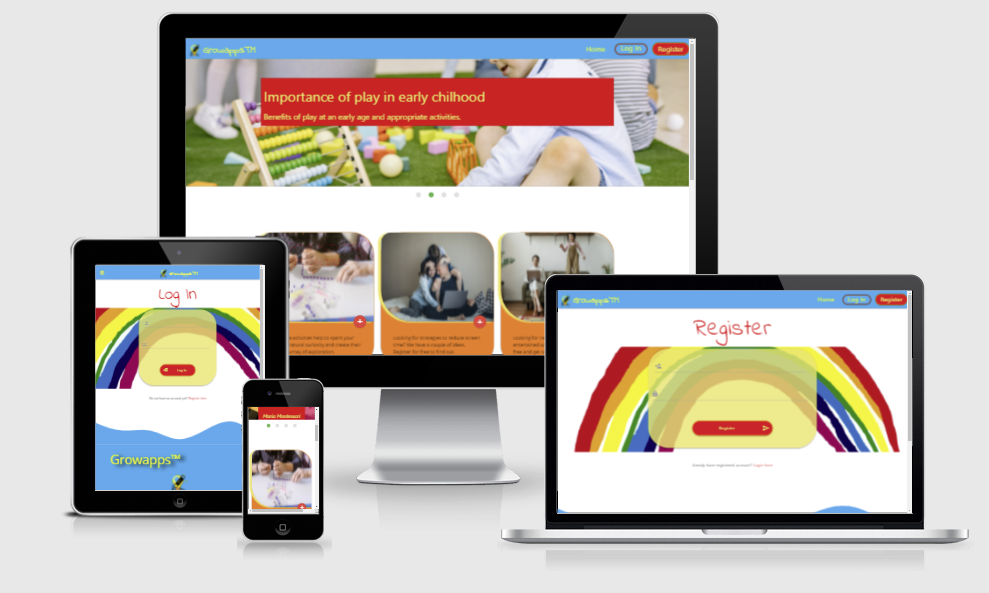

# [Growapps](http://ms3-project-ci.herokuapp.com/home)

## 

---

 

- Link to live website : [Growapps](http://ms3-project-ci.herokuapp.com/home)
---

##### Table of Contents  
[UX](#ux)  
[User](#usergoals)  
[Existing](#existing)

## UX
<a name="ux"/>

### User Stories

- User 1 : 
- User 2 : 
- User 3 : 
- User 4 : 
- User 5 : 

### User Goals
<a name="usergoals"/>

- First Time Visitor

- Returning Visitor

## Existing features
<a name="existing"/>

- Color scheme

- Typography
## Features Left to Implement

## Database Design

## Project Requirements
### Main Technologies:

- HTML5, CSS3, JavaScript, Python+Flask, MongoDB

## Frameworks and libraries:

- [**Werkzeug**](https://werkzeug.palletsprojects.com/en/2.0.x/) used for authentication and password security.
- [**Jinja**](https://jinja.palletsprojects.com/en/3.0.x/) used as templating engine to render backend data in html.
- [**Flask**](https://flask.palletsprojects.com/en/2.0.x/) used as a web framework for routing and rendering templates.
- [**Materialize**](https://materializecss.com/) used as a framework to increase page responsiveness .
- [**jQuery**](https://jquery.com/) used as a JavaScript library and for Materialize components initalization.

## Other Technologies used:
- [**MongoDB**](https://www.mongodb.com/) used for hosting deployed website.
- [**Heroku**](https://www.heroku.com/) used as a project's database.
- [**Google Dev Tools**](https://developer.chrome.com/docs/devtools/) used for developing and testing webpage.
- [**Firefox Dev Tools**](https://developer.mozilla.org/en-US/docs/Tools) used for developing and testing webpage.
- [**Get Waves**](https://getwaves.io/) used to generate SVG banner.
- [**Balsamiq**](https://balsamiq.com) used for creating a wireframe.
- [**Resize Pixel**](https://www.resizepixel.com/) Free online image editor used to resize images format.
- [**Google Fonts**](https://fonts.google.com) used for project fonts.
- [**Google Icons**](https://fonts.google.com) used for project icons.
- [**Gitpod**](https://gitpod.io) used as a development environment.
- [**Gitpod Chrome Extension**](https://chrome.google.com/webstore/detail/gitpod-dev-environments-i/dodmmooeoklaejobgleioelladacbeki) used to open Github repo in Gitpod.
- [**GitHub**](https://github.com/) used for storing repository. 
- [**Canva**](https://www.canva.com) used for logo creation.
- [**Autoprefixer**](https://autoprefixer.github.io/) used to add CSS prefixes and ensure cross-browser compatibility.
- [**Youtube**](https://www.youtube.com/) used as a general source of information.
- [**W3Scool**](https://www.w3schools.com/) used as a general source of information.
- [**Pexel**](https://www.pexels.com/) used to download the website's images.
- [**Pixabay**](https://pixabay.com/) used to download the website's images.
- [**Stackoverflow**](https://stackoverflow.com/) used as a general source of information.
- [**W3C Markup Validator**](https://validator.w3.org/) Used to test HTML code validation.
- [**W3C CSS Validator - Jigsaw**](https://jigsaw.w3.org/css-validator/) Used to test CSS code validation.
- [**PEP8 online**](http://pep8online.com/) used during post deployment testing stage to ensure PEP8 requuirement.
- [**Am I Responsive**](http://ami.responsivedesign.is/) used during post deployment testing stage.
- [**Pixlr**](https://pixlr.com) used to remove background and editing photographs.

## Project Wireframe Link :

## Testing :

## Deployment

## Credits :

### Code snippets :

### Photographers :
- Pexels

- Pixabay

## Acknowledgements

 

