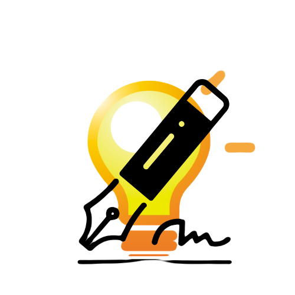

# [Growapps](http://ms3-project-ci.herokuapp.com/home)

## 

---

 

- Link to live website : [Growapps](http://ms3-project-ci.herokuapp.com/home)
---
Growapps is aimed towards those interested in looking for a  place where they can find or share ideas about child development. The initial idea to create this project as a third milestone project with the Code Institute, appeared during the times of lockdowns,where movements and interaction with others was limited. To help those who were in search of a source to help them continually develop their child skills with limited resources Growapps was created. Welcome to Growapps!

##### Table of Contents  
- [UX](#ux)  
- [The Site owner Goals](#usergoals)  
- [Existing Features](#existing)
- [Features Left to Implement](#leftfeatures)
- [Database Design](#dbdesign)
- [Project Requirements](#prequrements)
- [Wireframes](#wireframe)
- [Testing](#testing)
- [Deployment](#deployment)
- [Credits](#credits)
- [Acknowledgments](#ack)

## UX
<a name="ux"/>

### User Stories

- User 1 : As a user I want to find source of ideas of how to keep my kids entertained.
- User 2 : As a user I want to share my ideas with others.
- User 3 : As a user I want to be able to edit my activites should I need.
- User 4 : As a user I want to be able to delete my activites should I need.
- User 5 : As a user I want to have a convenient access to the data provided by all other members.
- User 6 : As a user I want to be able to register as a regular user.
- User 7 : As a user I want to be able to login to my account as a registered user.

### The Site owner Goals
<a name="usergoals"/>

- As a site owner I want to benefit from the collection of the dataset.
- As a site owner I want to promote other brands whose business is involving child development.

## Existing features
<a name="existing"/>

### Unregistered users
- Langing Page

- Navigation bar
    * Company Logo
    * Home Button
    * Login Button
    * Register Button

- Mobile sidenav for mobile devices
    * Company Logo
    * Home Button
    * Login Button
    * Register Button

- Image slides with text content describing purpose of the website.

- Three card panels inviting users to register.
- Web site footer
    * Company logo
    * Copyright 
    * Useful liks
- Login page
- Register page
- Error 404 page
    * Will appear in case of when server can't find the requested resource.
- Error 500 page
    * Will appear in case if the server encountered an unexpected condition.

### Registered users

- Registered users have access to most of the features apart from the admin's page.
In case that registered user attempts to access admin page, the wil not be able to an will be notified that they need admin rights.
- Activities page
    * Search bar
        * Search button
        * Reset Search button
        * Add activity button
- Activitiy card panels
    * Ability to read all activities;       
    * Ability to edit your own activities;  
    * Ability to delete your own activities;  
    * Ability view all activities on a single page.
- Modal pop up
    * Will apear in case if the user tries to edit or remove activity, asking for confirmation.
- Log Out button
- My Profile button
    * List of all activities created by the user.
- Admin page
    * Restricted to admin only.
## Admin
- Admin page cosists of the card panels with all curent activity categories. Admin has a right to edit and/or remove activities from all users.
    * Ability to remove and update existing category.
- Add category button
    * Ability to add a new activity category.

- Color scheme
    * Color palette for the website has been generated using [Colormind](http://colormind.io).
    Carefully selected color scheme with the idea in mind to create harmonious and aesthetically pleasing website where users would want to remain longer.

 

- Typography
    * The website fonts used are Google fonts [Indie Flower](https://fonts.google.com/specimen/Indie+Flower#standard-styles) for headers.The header's  are sized quite large for easier readability and at the same time to create personal looking, almost handwriting effect  .Google fonts [Open Sans](https://fonts.google.com/specimen/Open+Sans?query=Open+Sans) font is used where a more formal way of expressing was required , such as instructions or login/register pages.

## Features Left to Implement
<a name="leftfeatures"/>

## Database Design
<a name="dbdesign"/>

## Project Requirements
<a name="prequrements"/>

### Main Technologies:

- HTML5, CSS3, JavaScript, Python+Flask, MongoDB

## Frameworks and libraries:
<a name="flibs"/>

- [**Jinja**](https://jinja.palletsprojects.com/en/3.0.x/) used as templating engine to render backend data in html.
- [**Flask**](https://flask.palletsprojects.com/en/2.0.x/) used as a web framework for routing and rendering templates.
- [**Materialize**](https://materializecss.com/) used as a framework to increase page responsiveness .
- [**jQuery**](https://jquery.com/) used as a JavaScript library and for Materialize components initalization.

## Other Technologies used:
- [**Werkzeug**](https://werkzeug.palletsprojects.com/en/2.0.x/) used for authentication and password security.
- [**PyMongo**](https://pymongo.readthedocs.io/en/stable/) used for interacting with MongoDB database from Python.
- [**dnspython**](https://www.dnspython.org/) used as a DNS toolkit for Python.
- [**functools**](https://docs.python.org/3/library/functools.html) used to create wraps and function decorator.
- [**MongoDB**](https://www.mongodb.com/) used as a project's database.
- [**Heroku**](https://www.heroku.com/)  used for hosting deployed website.
- [**RandomKeygen**](https://randomkeygen.com/)  used for creating Fort Knox Passwords.
- [**Google Dev Tools**](https://developer.chrome.com/docs/devtools/) used for developing and testing webpage.
- [**Firefox Dev Tools**](https://developer.mozilla.org/en-US/docs/Tools) used for developing and testing webpage.
- [**Get Waves**](https://getwaves.io/) used to generate SVG banner.
- [**Balsamiq**](https://balsamiq.com) used for creating a wireframe.
- [**Resize Pixel**](https://www.resizepixel.com/) Free online image editor used to resize images format.
- [**Google Fonts**](https://fonts.google.com) used for project fonts.
- [**Google Icons**](https://fonts.google.com/icons) used for project icons.
- [**Gitpod**](https://gitpod.io) used as a development environment.
- [**Gitpod Chrome Extension**](https://chrome.google.com/webstore/detail/gitpod-dev-environments-i/dodmmooeoklaejobgleioelladacbeki) used to open Github repo in Gitpod.
- [**GitHub**](https://github.com/) used for storing repository. 
- [**Canva**](https://www.canva.com) used for logo creation.
- [**Autoprefixer**](https://autoprefixer.github.io/) used to add CSS prefixes and ensure cross-browser compatibility.
- [**Youtube**](https://www.youtube.com/) used as a general source of information.
- [**W3Scool**](https://www.w3schools.com/) used as a general source of information.
- [**Pexel**](https://www.pexels.com/) used to download the website's images.
- [**Pixabay**](https://pixabay.com/) used to download the website's images.
- [**Stackoverflow**](https://stackoverflow.com/) used as a general source of information.
- [**W3C Markup Validator**](https://validator.w3.org/) Used to test HTML code validation.
- [**W3C CSS Validator - Jigsaw**](https://jigsaw.w3.org/css-validator/) Used to test CSS code validation.
- [**PEP8 online**](http://pep8online.com/) used during post deployment testing stage to ensure PEP8 requuirement.
- [**Am I Responsive**](http://ami.responsivedesign.is/) used during post deployment testing stage.
- [**Pixlr**](https://pixlr.com) used to remove background and editing photographs.

## Project Wireframe Link :
<a name="wireframe"/>

To see Project Wireframes please click the link: 
<a href="https://github.com/kuzGo/MS3-Project-CI/tree/main/static/wireframes">Wireframes</a>

## Testing :
<a name="testing"/>

- Click here to see testing in a separate file: [Testing](https://github.com/kuzGo/MS3-Project-CI/blob/main/TESTING.md) 
## Deployment
<a name="deployment"/>

## Credits :
<a name="credits"/>

### Code snippets :

### Photographers :
- Pexels
- [Pexels](https://www.pexels.com/photo/children-doing-arts-and-crafts-at-school-8612992/)
- [Pexels](https://www.pexels.com/photo/boy-in-blue-long-sleeve-shirt-and-denim-shorts-playing-with-wooden-toy-cars-8612955/)
- [Pexels](https://www.pexels.com/photo/sea-sunny-beach-vacation-7862529/)
- [Pexels](https://images.pexels.com/photos/311268/pexels-photo-311268.jpeg?auto=compress&cs=tinysrgb&dpr=2&h=750&w=1260)
- [Pexels](https://images.pexels.com/photos/8435803/pexels-photo-8435803.jpeg?auto=compress&cs=tinysrgb&dpr=1&w=500)
- [Pexels](https://images.pexels.com/photos/1107911/pexels-photo-1107911.jpeg?auto=compress&cs=tinysrgb&dpr=1&w=500)
- [Pexels](https://images.pexels.com/photos/4484878/pexels-photo-4484878.jpeg?auto=compress&cs=tinysrgb&dpr=1&w=500)
- [Pexels](https://images.pexels.com/photos/3662670/pexels-photo-3662670.jpeg?auto=compress&cs=tinysrgb&dpr=1&w=500)
- [Pexels](https://images.pexels.com/photos/168866/pexels-photo-168866.jpeg?auto=compress&cs=tinysrgb&h=750&w=1260)
- Photo by RODNAE Productions from Pexels
- pexels-elina-fairytale-4008773 
- Photo by Ketut Subiyanto from Pexels 

- Pixabay
- [Pixabay](https://pixabay.com/illustrations/illustration-child-clipart-graphics-2814002/)

## Acknowledgements
<a name="ack"/>
 

