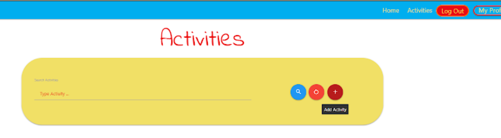

# Testing :

At various stages of the project development I have been using extensive testing of the website.Main tools used to test the website are Google Dev Tools,Firefox Dev Tools . To validate the code  I have been using W3C Markup Validator, W3C CSS Validator - PEP8 Online to ensure proper indentation and full PEP8 compliance. During development The [Built-In Flask's Debugger](https://flask.palletsprojects.com/en/2.0.x/debugging/) was set to `True` so the code has been refactored on multiple occasions should any errors occurred.

One of the major issues that occurred during the development stage was installing Flask-login. Even though authentication was already implemented , I attempted to increase control of who will have access to certain website pages by installing `pip3 flask-login`. Upon pushing all changes to the deployed website I noticed that an app would no longer run.
After troubleshooting I found the error in Heroku's Latest activity dashboard, the latest build failed.

 
 2021-08-15T23:02:11.021890+00:00 heroku[router]: at=error code=H10 desc="App crashed" method=GET path="/" host=ms3-project-ci.herokuapp.com request_id=865be830-4f18-4cd8-8c9c-fbea5a995aee fwd="37.228.200.107" dyno= connect= service= status=503 bytes= protocol=https
2021-08-15T23:02:11.204746+00:00 heroku[router]: at=error code=H10 desc="App crashed" method=GET path="/favicon.ico" host=ms3-project-ci.herokuapp.com request_id=d6a6ba76-421f-4bd3-855c-73499f456bfb fwd="37.228.200.107" dyno= connect= service= status=503 bytes= protocol=https
2021-08-15T23:02:14.381538+00:00 heroku[router]: at=error code=H10 desc="App crashed" method=GET path="/" host=ms3-project-ci.herokuapp.com request_id=6cdef621-21f9-41a9-bb97-f1b020119ce6 fwd="37.228.200.107" dyno= connect= service= status=503 bytes= protocol=https
2021-08-15T23:02:14.519507+00:00 heroku[router]: at=error code=H10 desc="App crashed" method=GET path="/favicon.ico" host=ms3-project-ci.herokuapp.com request_id=b66d8eb8-9feb-4ffc-bd18-fd7d1c08a1e9 fwd="37.228.200.107" dyno= connect= service= status=503 bytes= protocol=https
2021-08-15T23:07:18.182266+00:00 heroku[router]: at=error code=H10 desc="App crashed" method=GET path="/" host=ms3-project-ci.herokuapp.com request_id=b10ae681-2474-4e58-9c5e-1370576af4b2 fwd="37.228.200.107" dyno= connect= service= status=503 bytes= protocol=https
2021-08-15T23:07:18.372198+00:00 heroku[router]: at=error code=H10 desc="App crashed" method=GET path="/favicon.ico" host=ms3-project-ci.herokuapp.com request_id=8a3b89cc-25d7-43cf-861e-8cf3fe6ac0ff fwd="37.228.200.107" dyno= connect= service= status=503 bytes= protocol=https
2021-08-15T23:07:33.079336+00:00 heroku[router]: at=error code=H10 desc="App crashed" method=GET path="/home" host=ms3-project-ci.herokuapp.com request_id=8616acab-b98a-4626-8970-8b55e3f4d468 fwd="37.228.200.107" dyno= connect= service= status=503 bytes= protocol=https
2021-08-15T23:07:33.394536+00:00 heroku[router]: at=error code=H10 desc="App crashed" method=GET path="/favicon.ico" host=ms3-project-ci.herokuapp.com request_id=ba1ea718-0c9d-453e-8109-389691e453b8 fwd="37.228.200.107" dyno= connect= service= status=503 bytes= protocol=https
2021-08-15T23:09:29.837859+00:00 heroku[router]: at=error code=H10 desc="App crashed" method=GET path="/" host=ms3-project-ci.herokuapp.com request_id=8fc78017-dce9-4b94-bb4c-b584cee7be8f fwd="37.228.200.107" dyno= connect= service= status=503 bytes= protocol=https
2021-08-15T23:09:29.989406+00:00 heroku[router]: at=error code=H10 desc="App crashed" method=GET path="/favicon.ico" host=ms3-project-ci.herokuapp.com request_id=4ba60ae2-5cf2-4e35-ba49-b80697cf6e4a fwd="37.228.200.107" dyno= connect= service= status=503 bytes= protocol=https

After re-searching Google for error code H10 I tried to restart all dynos. As it failed to restart I tried uninstaling flask-login as it was not used in my project, which eventually solved the issue.
Another issue I ran into was a wrongly positioned Jinja's `` loop. I tried repositioning ``for`` and ``if`` statements but it would make every new dataset added to the database render as it was not expected. I reached out to the #backend-dev channel on Slack and asked for assistance. The channel lead Amy pointed me in the right direction and later I found what the issue was.

### Image of rendered page:

 
 

### Image of HTML Template:

 
  

Another bug spotted during a project review on Slack's #peer-code-review channel was brought to my attention by the Code Institute student Yigit. This was fixed by adding classes to ``@media`` query for mobile screen size devices.
> Yigit  3 days ago
Hey @Goran, nice project! Couple things caught my eye tho; Some of the images look a bit stretched on iphone XS,  and you may want to reduce the font-size for the flash messages. Good luck!

 
 

 
 

## Code Validation

- Results of CSS code validation:
      - Code shows no errors.Note: Warnings are due to prefixes added using Autoprefixer to ensure cross-browser compatibility.     

   <a href="static/docs/W3C CSS Validator.pdf" target="_blank" >Link to CSS Validation PDF Document</a>

   

    
   

       
  

   
   

- Results of HTML code validation:
      - Document checking completed. No errors or warnings to show.

     [The W3C Markup Validatior](https://validator.w3.org/nu/?doc=https%3A%2F%2Fms3-project-ci.herokuapp.com%2F)

  <a href="static/docs/Nu Html Checker.pdf" target="_blank" >Link to HTML Validation PDF Document</a>

- Results of Python PEP8 code validation:

 
 

### Lighthouse reports of deployed website:

Lighthouse mobile report:

 
 

Lighthouse desktop report:

 
 

### User stories testing :

- User 1 : As a user I want to find a source of ideas of how to keep my kids entertained.
    - I registered as a user to Growapps and was able to see a collection of different activities for kids.

 

 

- User 2 : As a user I want to share my ideas with others.
    - I logged in to Growapps and was able to share the idea of how to  play  Color treasure hunt  with other users.

 

 

 

- User 3 : As a user I want to be able to edit my activities should I need to.
    - I logged in to Growapps and was able to edit activity I posted previously but noticed a typo.

 

 

- User 4 : As a user I want to be able to delete activities should I need to.
    - I logged in to Growapps and was able to delete activity. When I clicked the remove button a modal popup appeared and asked to confirm whether or not I wanted to delete my post.When I clicked delete, a message appeared notifying me it was deleted.

 

 

 

 

- User 5 : As a user I want to have convenient access to the data provided by all other members.
     - I registered as a user to Growapps and was able to see a collection of different activities for kids posted by other users.

 

- User 6 : As a user I want to be able to register as a regular user.
      - I was able to easily navigate to convenient registration page and to register as a user.

 

 

- User 7 : As a user I want to be able to login to my account as a registered user.
    - I was able to create a strong password and to login into Groapps securely every time after registration.

 

   

### Functionality testing :

As part of functionality testing the developer tested every part of the website to ensure that everything is working properly on different types of devices and screen sizes. Browsers that the website has been tested on are as follows:Google Chrome, Firefox, Microsoft Edge and Safari on Apple devices.Testing of the website was conducted on numerous devices that I and my close relatives and friends own,these are as follows : Samsung S10E, Samsung S20,Samsung A52 Pixel3a,iPhone XS. Laptop Google Pixelbook and Desktop screen sizes all report no issues.

- Navigation bar:
1. When the company logo is clicked it will bring the user to the home/landing page regardless of what page the user visits.
2. The Home button will change the text color to red when hovered over. When clicked it will bring the user to the homepage. 
3. The Login button is styled slightly differently than the other two buttons to emphasise it's functionality.When hovered over it'll change the text and background color, when clicked it'll bring the user to the Login page.
4. The Register button is styled slightly differently than the other two buttons to emphasise it's functionality and bring the user's attention and click register. When hovered over it will change the background and text color and when clicked it will bring the user to the register page.

- Homepage:
1. Image sliders, is a full width of the screen with indicator showing which item is displayed.Each photo consists of text content describing the purpose of the website.
- Three card panels with the image and informative text content , inviting users to register.
When the plus button is clicked there are two possible outcomes:

1. If users are not logged in , they will be prompted to the Login page.

 

   
2. If the users are logged in they will be directed to the Activity page.

- The Website footer is simple and is spreading across all pages. It contains  a company logo and some useful links with related businesses.The bottom of the footer contains copyright and the owners Linkedin link for contact.

- The login  page is dominant across the entire page with a number of functionalities. 
- Login form indicates to the user that password and username must be between 5 and 20 characters. 

 

  

- If the requirement is not met, the user will not be able to login.If the username is correctly entered, the password has to meet the same requirements.Helper text will notify the user and will also count the characters and display them.

 

  

- If the user enters a wrong password , they will not be able to login. If the user does not have a registered account , they can click the link below, which will lead the to the register page.

 

  

- Register page:

- The register page is dominant across the entire page with a number of functionalities.
- Register form indicates to the user that password and  username must be between 5 and 20 characters. 
- If the requirement is not met, the user will not be able to register.
- If the username is correctly entered, the password has to meet the same requirements.Helper text will notify the user and will also count the characters and display them.
- If the user enters a username that already exists they will not be able to register and will be notified.

 

  

- If the user already has a registered account , they can click the link below, which will lead to the login page.
